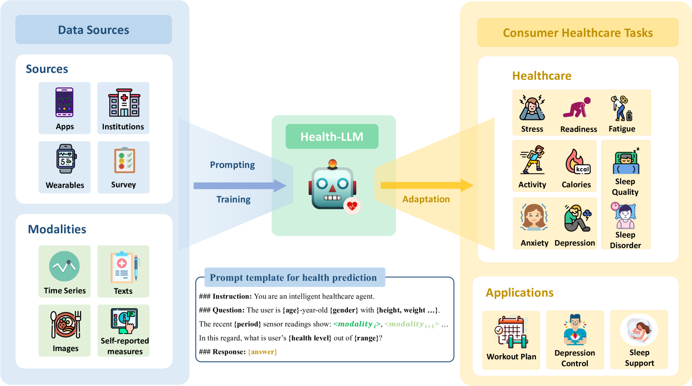

## AI & ML
{: .no_toc }

## Table of Contents
{: .no_toc .text-delta }

1. TOC
{:toc}
---

## Machine Learning for mHealth Pilots 

The integration of machine learning (ML) into mobile health (mHealth) pilot studies represents a significant development in the application of advanced analytics to enhance healthcare delivery. Machine learning techniques enable the analysis of large volumes of data from wearables and other sensors, providing deeper insights into patient health and facilitating the customization of healthcare interventions.

<iframe width="560" height="315" src="https://www.youtube.com/embed/OCadQgthWjc?si=Zs_9qvr6NHcOSXvZ" title="YouTube video player" frameborder="0" allow="accelerometer; autoplay; clipboard-write; encrypted-media; gyroscope; picture-in-picture; web-share" referrerpolicy="strict-origin-when-cross-origin" allowfullscreen></iframe>

In this talk, Dr. Benjamin Marlin, MassAITC Associate Director, discusses the application of machine learning approaches in mobile health (mHealth) and builds a conceptual model to understand how machine learning fits into the mHealth context. The model includes observational and interventional study designs, where machine learning is used to mediate between the state and outcome information inferred about the participant or environment and the data collected via various modalities. Machine learning is also used to optimize the selection of intervention components in just-in-time adaptive interventions.

Dr. Marlin presents an overview of the machine learning toolkit, which includes methods for inference, prediction, data representation, and decision making. The main categories of machine learning problems discussed are classification, regression, clustering, dimensionality reduction, and reinforcement learning. Each category is explained with examples from various domains, highlighting their potential applications in mHealth.

He also provides a detailed walkthrough of the application of machine learning methods for state inference, specifically focusing on smoking puff detection using respiration data from a chest band sensor. The process involves featurization of the raw sensor data, labeling the data with ground truth, and learning a classification function that can predict whether a new respiration cycle corresponds to a smoking puff or a regular non-puff cycle. Dr. Marlin emphasizes the importance of considering the broader context of deploying machine learning models in mHealth, including data collection, cleaning, feature extraction, and model evaluation.

## Challenges for ML in mHealth

Implementing machine learning in mHealth presents several challenges. Dr. Marlin also highlights six key issues that need to be addressed when applying machine learning techiques to mHealth studies. We encourage pilots to consider these issues when applying machine learning techniques to their data, and reach out to your MassAITC mentor if you questions.

* **Label scarcity**: Collecting a sufficient number of accurate labels in mHealth can be difficult and costly due to trade-offs between ecological validity and fidelity of label collection.
* **Feature design**: Effective feature engineering is crucial for machine learning to work well in mHealth. Deep learning approaches can help extract good representations from data but typically require more data.
* **Incompleteness**: Input data in mHealth are rarely completely observed due to issues like non-wear and non-compliance with self-reported items, which can cause problems for most machine learning methods.
* **Lab to field generalization**: Models trained on lab data may fail to generalize well to the field due to differences in ecological validity and the context in which the data are collected.
* **Between-subject variability**: Small studies with diverse participants can make model building difficult, as there may not be enough similar individuals to learn from, leading to issues with generalization to new subjects.
* **Algorithmic bias**: Standard machine learning models can learn biases based on the composition of the input cohorts, potentially leading to systematic underperformance on underrepresented groups in the data.

## Open software packages

The use of open software packages in mHealth is crucial due to the complex nature of transforming raw data into usable digital biomarkers. Open-source platforms enable collaborative development and sharing of advancements, making sophisticated data processing tools more accessible. They also help manage the computational demands and technical complexities associated with developing and applying machine learning models, thus fostering innovation in mHealth research.

<iframe width="560" height="315" src="https://www.youtube.com/embed/8m5llOl39z4?si=3EQi-T7veB9adbvx" title="YouTube video player" frameborder="0" allow="accelerometer; autoplay; clipboard-write; encrypted-media; gyroscope; picture-in-picture; web-share" referrerpolicy="strict-origin-when-cross-origin" allowfullscreen></iframe>

In this talk, Dr. Jessica Dunn introduces the Digital Biomarker Discovery Pipeline (DBDP  [[1]](#1) ), an open-source toolbox for biosignal analysis aimed at addressing challenges in mobile health (mHealth) research, such as sensor accuracy, data interoperability, and data volume. The DBDP provides a repository of code, data, and algorithms to make digital biomarker discovery more accessible and establish best practices in the field. The Digital Biomarker Discovery Project provides a number of useful tools from accessing and preprocessing sensor data to development of statistical modeling, machine learning, and deep learning algorithms.

Dr. Dunn presents two case studies to demonstrate the DBDP's capabilities in addressing sensor accuracy and validation challenges. The first case study involves validating heart rate measurements from consumer wearables against a reference standard ECG device. The study reveals that device type and physical activity affect heart rate accuracy, with no significant impact of skin tone on the devices tested. The second case study assesses and monitors a consumer wearable for circadian rhythm monitoring, highlighting gaps in existing tools and the development of patches for future studies.

To address the challenge of data deluge, Dr. Dunn discusses strategies for minimizing data volumes while maximizing the accuracy of digital biomarkers. These strategies include reducing signal-level data collection, developing application-driven data compression methods, and intelligently aggregating data. Dr. Dunn emphasizes the importance of collaboration within the mHealth community to leverage wearables and sensor data for patient empowerment, precision therapies, just-in-time interventions, and improved access to care.

## Large Language Models (LLMs) for Dementia Care

Given the extraordinary capabilities of Large Language Models (LLMs), a topic of interest to many pilots is how to leverage LLMs in the context of older adults with AD/ADRD. We briefly overview two recent articles to illustrate the broad space of problems that can potentially be tackled by LLMs in the context of dementia care as well as a specific instance of an LLM that is relevant to at-home studies involving older adults.

**LLMs for dementia care** In the paper "Introduction to Large Language Models (LLMs) for dementia care and research," Treder et al. [[2]](#2) explore the potential applications and usefulness of LLMs in the context of dementia care and research. 

The study investigates various domains related to dementia, identifying opportunities for LLMs to enhance understanding, diagnostics, and treatment, with a broader emphasis on improving patient care. The specific contributions of LLMs are examined, such as their ability to engage users in meaningful conversations, deliver personalized support, and offer cognitive enrichment. Potential benefits encompass improved social interaction, enhanced cognitive functioning, increased emotional well-being, and reduced caregiver burden.

The authors also discuss the concerns and considerations raised by the deployment of LLMs in caregiving frameworks, including privacy and safety concerns, the need for empirical validation, user-centered design, adaptation to the user's unique needs, and the integration of multimodal inputs to create more immersive and personalized experiences. The importance of establishing ethical guidelines and privacy protocols to ensure responsible and ethical deployment of LLMs is emphasized.

The paper reports the results of a questionnaire filled in by people with dementia (PwD) and their supporters, surveying the usefulness of different application scenarios of LLMs and the features that LLM-powered apps should have. Both PwD and supporters were largely positive regarding the prospect of LLMs in care, although concerns were raised regarding bias, data privacy, and transparency.

Overall, LLMs have the potential to positively impact dementia care by boosting cognitive abilities, enriching social interaction, and supporting caregivers. 

**LLM for mHealth Prediction via Wearable Sensor Data** Another question of interest to at-home monitoring is the role of LLMs in analyzing wearable sensor data.  In the paper "Health-LLM: Large Language Models for Health Prediction via Wearable Sensor Data,"  [[3]](#3)  Kim et al. investigate the potential of large language models (LLMs) for delivering multimodal health predictions based on contextual information (e.g., user demographics, health knowledge) and physiological data (e.g., resting heart rate, sleep minutes). The authors evaluate eight state-of-the-art LLMs with diverse prompting and fine-tuning techniques on six public health datasets, covering thirteen consumer health prediction tasks in mental health, activity, metabolic, sleep, and cardiac assessment.

The study finds that zero-shot prompting shows comparable results to task-specific baseline models, indicating that LLMs already have promising capabilities for health prediction tasks based on wearable data. Few-shot prompting with larger LLMs, such as GPT-3.5 and GPT-4, effectively grounds numerical time-series data, resulting in significant improvements over zero-shot learning and fine-tuned models in some tasks. The authors' fine-tuned model, Health-Alpaca, exhibits the best performance in 5 out of 13 tasks despite being substantially smaller than GPT-3.5 and GPT-4.

Ablation studies highlight the effectiveness of context enhancement strategies, with the inclusion of health knowledge context in prompts significantly enhancing overall performance. The study demonstrates that constructing contextually rich prompts, combining user context, health knowledge, and temporal information, leads to synergistic improvement in LLM performance on health prediction tasks.

The findings of this paper underscore the potential of LLMs as reasoning engines for wearable data, showcasing their ability to deliver accurate health predictions by leveraging contextual information and physiological data. The authors' work contributes to the growing body of research exploring the application of AI in the wearables domain, demonstrating the effectiveness of prompting and fine-tuning techniques in adapting LLMs to consumer health prediction tasks. The release of the fine-tuned model, Health-Alpaca, as an open-source LLM targeted for consumer health prediction tasks, further facilitates the adoption and advancement of AI in the wearables space.

<a id="1">[1]</a> 
Bent, Brinnae, Ke Wang, Emilia Grzesiak, Chentian Jiang, Yuankai Qi, Yihang Jiang, Peter Cho et al. "The digital biomarker discovery pipeline: An open-source software platform for the development of digital biomarkers using mHealth and wearables data." Journal of clinical and translational science 5, no. 1 (2021): e19.

<a id="2">[2]</a> 
Treder, Matthias Sebastian, Sojin Lee, and Kamen Atanasov Tsvetanov. "Introduction to Large Language Models (LLMs) for dementia care and research." Frontiers in Dementia 3: 1385303.

<a id="3">[3]</a> 
Kim, Yubin, Xuhai Xu, Daniel McDuff, Cynthia Breazeal, and Hae Won Park. "Health-llm: Large language models for health prediction via wearable sensor data." arXiv preprint arXiv:2401.06866 (2024).

