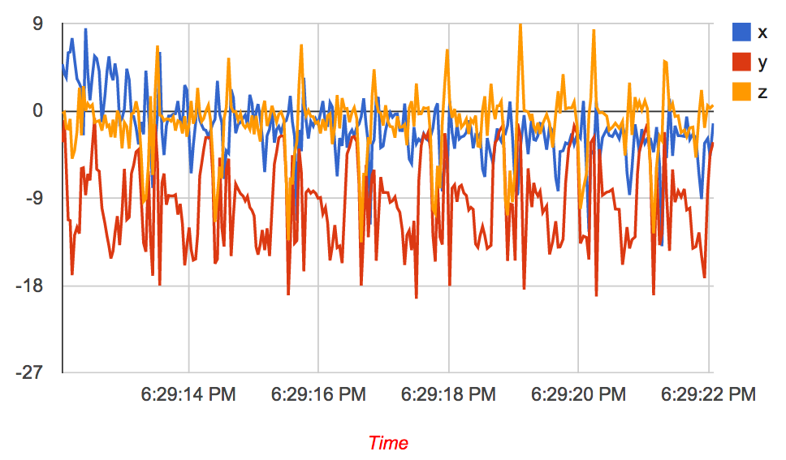
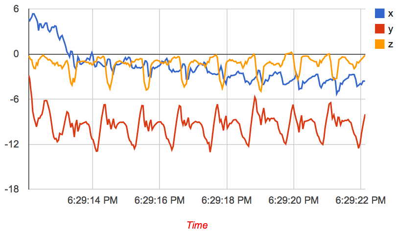

# Chapter 1: Time-series Smoothing and Filtering

We start our discussion of smoothing methods with the simplest method, moving average smoothing and proceed to a variant of this method referred to as exponential weighted smoothing. The fact that they are simple doesn’t mean that they are not useful - in spite of their simplicity, these methods are surprisingly effective in practice, and therefore very widely used.

## Over-sampling and Averaging

Many sources of noise tend to be random in nature. Informally, this means that the noise has roughly equal amounts of positive and negative changes, and there is no pattern in the noise over time. Formally, the noise is said to be uncorrelated in time, has zero mean, and finite variance. 

In this case, noise can be reduced by over-sampling the sensor and averaging the values. For example, take the case where you are writing an algorithm to determine the rotation of the screen of the mobile phone. If there were no noise, you may sample at a low rate of say 10 Hz (or 10 times/second), but since you have noise due to small hand movements (if you are holding the phone), you may use a sampling rate of 100 Hz. You can then average every 10 samples readings and the average value is reported at a 10 Hz frequency and used in the application to determine whether the screen has rotated. In this way, the noise in the acceleration signal is reduced. You might ask how much the noise reduces by this method. Mathematically, if you have N samples of a random noise signal, and average these samples, your noise reduces by a factor of 1/√N.

## Moving Average Smoothing

Instead of averaging and reducing the number of samples, one can also perform a moving average. Lets try use an example to illustrate this approach. Figure 1 shows a noisy accelerometer signal, and let us try to apply a moving average smoothing to this signal. We are going to replace each sample by the average of the current sample, the sample before it, and the sample after it. 

More precisely, let us represent the input accelerometer signal as follows:

x =  x1, x2, x3, … xn where the index is the sample number.

The output of the moving average filter is:

  _s1_ = (x1 + x2 + x3)/3

 _s2_ = (x2 + x3 + x4)/3

 _s3_ = (x3 + x4 + x5)/3

  …

 _sn-2_ = (xn-2 + xn-1 + xn)/3

In the example above, we averaged three input values together, but we could have averaged more nearby points to smooth even more aggressively. As you increase the smoothing window, the signal will look cleaner and more visually pleasing, but beware of using too large a window since you will smooth out the important characteristics of the signal (for example, steps if you want to do step detection).

## Exponential smoothing

Moving average assumes random noise where the statistics of the noise does not change over time. But what happens if the noise itself is a time varying? In this case, exponential smoothing is an effective alternative that works well in practice. The key idea is a small twist on the moving average method described earlier. Whereas the moving average smoothing gives equal weight to the set of values that are averaged, the idea in exponential smoothing is to assign exponentially decreasing weights as the observation get older. In other words, recent observations are given relatively more weight than the older observations.

where α is the smoothing factor, and 0 &lt; α &lt; 1. In other words, the smoothed output _st _is a simple weighted average of the current observation _xt_ and the previous smoothed output _st-1_. 

You might wonder why this is called exponential smoothing, but this will become evident if you expand the above equation by substituting the defining equation for simple exponential smoothing back into itself 

In other words, as time passes the smoothed statistic st becomes the weighted average of a greater and greater number of the past observations xt−n, and the weights assigned to previous observations are in general proportional to the terms of the geometric progression {1, (1 − α), (1 − α)2, (1 − α)3, ...}. A geometric progression is the discrete version of an exponential function, so this is where the name for this smoothing method originated.

The smoothing factor applied to α here is something of a misnomer, as larger values of α actually reduce the level of smoothing, and with α = 1 the output series is just the same as the original series (with lag of one time unit). Simple exponential smoothing is easily applied, and it produces a smoothed signal as soon as two observations are available.

The effect of exponential smoothing of an accelerometer signal obtained during walking is shown in Figure 3. You can now start to see the distinct steps much more cleanly, and you can even count them quite easily by eye. At this point, you might even be considering different possible algorithms that can automatically extract steps from the smoothed signal. Not bad for a simple smoothing algorithm!

_Figure 56: (left) accelerometer signal during walking without smoothing (right) after exponentially weighted smoothing with smoothing = 6 (i.e. _α = ⅙).

To see exponential averaging in practice, check out the demo in [2]. Try changing the smoothing parameter, and see its effect on the signal (the smoothing parameter is 1/α, so larger smoothing means smaller α). 

## Median Filtering

When the noise appears like sudden spikes in the data (also referred to as salt-and-pepper noise), then the moving average and exponential smoothing methods are not the best methods. An example is shown below, where the noise pattern comprises sharp spikes in the data. Exponential smoothing will remove noise, but has two issues. First, it averages some of the peaks in the data and they don’t quite have the same amplitude. Second, you will notice that the averaging causes a time lag in the peaks i.e. the peaks are shifted slightly to the right of the original peak. 

_Figure 7: Exponential smoothing vs Median filtering. Median filtering is better for removing spikes in the signal (salt-and-pepper noise) compared to exponential smoothing._

One solution to this issue is to use median filtering. The median filter operates over sliding windows as with moving average and exponential smoothing, but computes the median over each window rather than the average. If the input accelerometer signal is: x =  x1, x2, x3, … xn , the output of the median filter is:

 _s1_ = median(x1 , x2 , x3)

 _s2_ = median(x2 , x3 , x4)

 _s3_ = median(x3 , x4 , x5)

  …

 _sn-2_ = median(xn-2 , xn-1 , xn)

Because they are so simple to implement and understand, time-domain smoothing is often the first methods tried when faced with a problem. These work exceedingly well in practice, so in many cases you can stop here. But knowing a little bit about other approaches can help you be considerably more effective for sensor signals, and will separate you from your peers. So, let us move on to discuss a very powerful technique for noise removal --- frequency-domain smoothing (or filtering).
