## Digital (Remote) Trial Platforms
{: .no_toc }

## Table of Contents
{: .no_toc .text-delta }

1. TOC
{:toc}
---

## Digital (Remote) Trial Platforms 

Digital trial platforms are pivotal in addressing the unique challenges posed by ADRD conditions. These platforms are designed to facilitate the complexities of conducting clinical trials in populations affected by cognitive impairments, ensuring that studies are efficient, patient-friendly, and yield high-quality data.  They also facilitate a variety of critical functions including participant recruitment, integration with wearables, smartphones and Internet of Things (IoT) devices, the deployment of Ecological Momentary Assessments (EMAs) and digital surveys such as RedCAP, and running different types of assessments. Effective software solutions can greatly simplify the time and effort to roll out a remote pilot study.

Below, we describe two available platforms, one commercial from CareEvolution which supports many remote studies including the [All of Us study](https://careevolution.com/case-studies/facilitating-precision-medicine-research-through-the-all-of-us-research-program/), and Radar-Base, an academic remote decentralized clinical trials platforms that has been used in AD-specific [Radar-AD study](https://www.radar-ad.org/).

### Tradeoffs when selecting an mHealth Platform 

There are a number of tradeoffs when selecting a platform to run your mHealth study. In the below video at the mHealth Training Institute, Dr. Predjag Klasnja describes that there are various options to consider including commercial software and hardware, white label solutions, hybrid systems, and custom systems. Each approach has its advantages and disadvantages in terms of usability, functionality, cost, and technical requirements. Commercial software and hardware are polished and well-maintained but may lack specific features needed for research. White label solutions offer more customization and responsive technical support but can be expensive and may not fit all project requirements. Hybrid systems combine commercial components with custom code, allowing researchers to focus on novel features while leveraging existing functionality, but integration can be suboptimal. Custom systems provide the most control over the user experience and data collection but are complex, time-consuming, and prone to bugs. 

Ultimately, the speaker emphasizes that there is no perfect solution, and researchers should strive to find the best compromise based on their specific needs and resources. Regardless of the chosen approach, mobile health studies are becoming increasingly complex and sophisticated, requiring extensive testing and collaboration with experts in different fields. Researchers should expect trade-offs and be prepared to handle bugs and unexpected issues.

<iframe width="560" height="315" src="https://www.youtube.com/embed/xdmH4UaOBUA?si=uNgYSEZW9wVgOC0V" title="YouTube video player" frameborder="0" allow="accelerometer; autoplay; clipboard-write; encrypted-media; gyroscope; picture-in-picture; web-share" referrerpolicy="strict-origin-when-cross-origin" allowfullscreen></iframe>

### Care Evolution

CareEvolution MyDataHelps is a platform for remote trials. The platform allows users to build surveys, schedule real-time notifications, launch projects, and digitally recruit participants without need to program. Participants join projects via the MyDataHelps app (available on iOS, Android, and web) to provide real-world participant health data from wearables, devices with EHR data, and EMAs. MyDataHelps integrates with a variety of wearable platforms including Apple Watch, Fitbit, Garmin, and others, as well as survey platforms such as RedCAP. They offer a free  account which allows you to invite and enroll up to 100 participants in your project. 

<iframe width="560" height="315" src="https://www.youtube.com/embed/FXBL5xMj9ig?si=p6blVDPtcrKPLoVk" title="YouTube video player" frameborder="0" allow="accelerometer; autoplay; clipboard-write; encrypted-media; gyroscope; picture-in-picture" allowfullscreen></iframe>

In the above video, Dr. Ed Ramos, the co-founder of the Digital Trial Center at Scripps Research and Chief Scientific Officer at Care Evolution, presents the opportunities and use cases for digital decentralized study approaches in clinical research i his MassAITC seminar on *Opportunities for Clinical Research Using a Digital, Decentralized Study Approach*. He highlights the advantages of this model, including increased access to diverse participant populations, reduced burden on participants, and the ability to collect continuous, real-world data using digital health technologies. The shift from a clinic-focused approach to a participant-centric model allows for more efficient and scalable research studies.

Dr. Ramos showcases several research platforms launched by the Digital Trial Center, including the DETECT study for COVID-19 prediction using wearable data, Power Mom for maternal health research, REFRESH for sleep medicine, and PROGRESS for precision nutrition. These platforms demonstrate the capabilities of digital decentralized trials, such as rapid enrollment, remote biosample collection, and the integration of multiple data sources (e.g., wearables, electronic health records, and patient-reported outcomes). The platforms also employ a baseline-substudy model, allowing for targeted research questions and interventions within the larger cohort.

Dr. Ramos emphasizes the importance of addressing diversity, equity, and inclusion in digital research trials, as this approach can help overcome barriers to participation and ensure that study populations are representative of those most likely to benefit from the research. He also discusses the growing recognition of decentralized clinical trials by funding agencies like the NIH and highlights specific funding opportunities, such as the NIA's recent FOA on Alzheimer's disease and related dementias, which seeks to leverage digital tools and real-world data platforms.

<!---
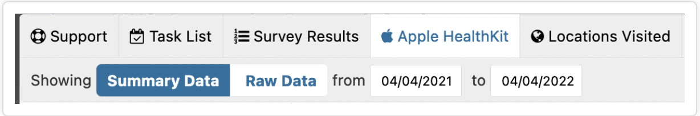
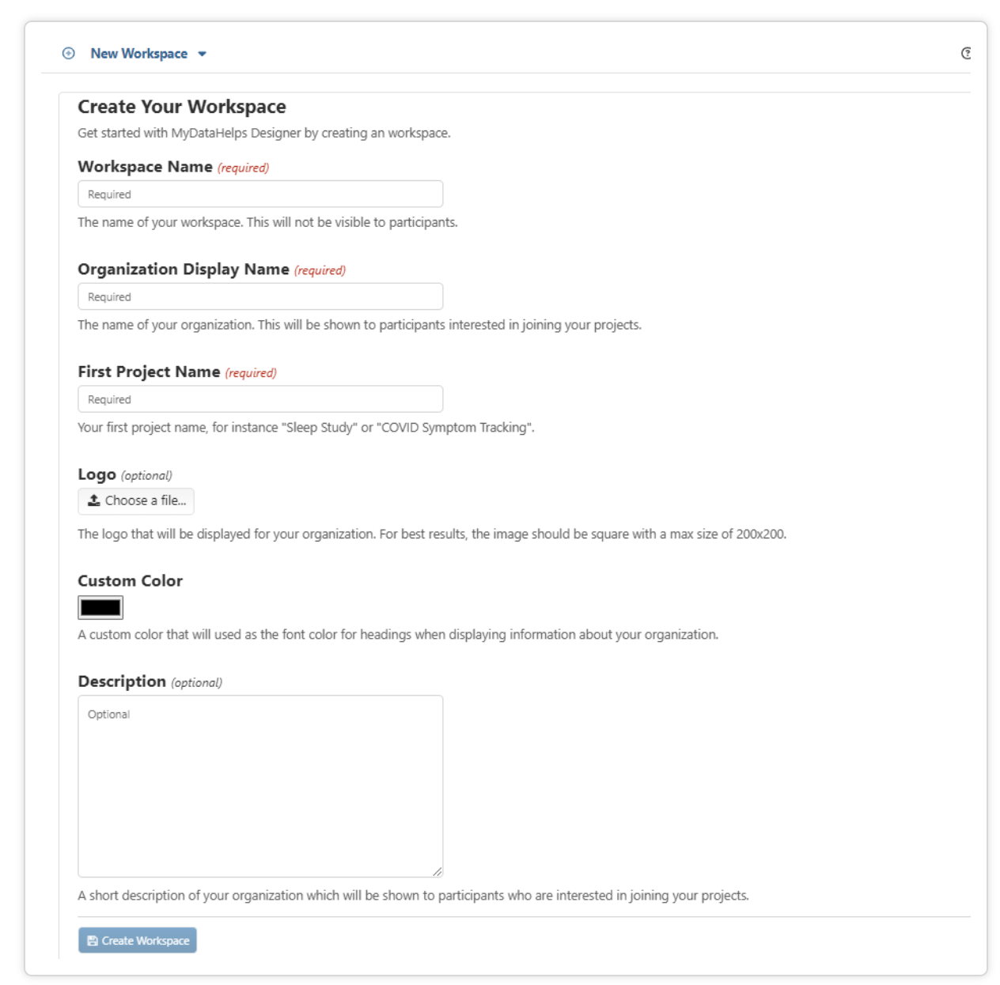
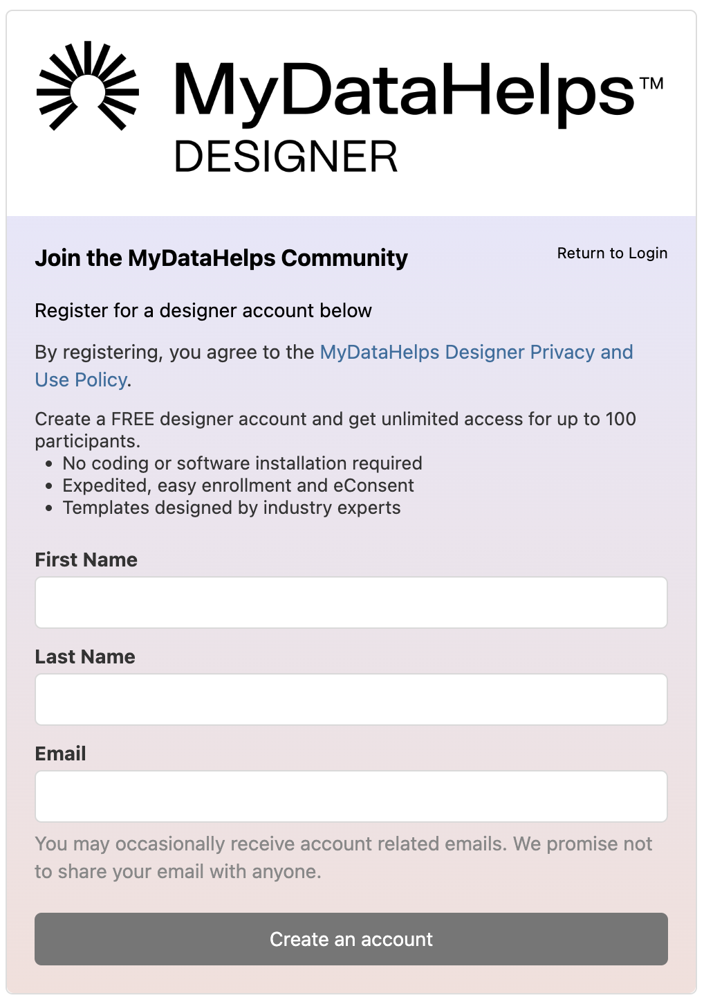

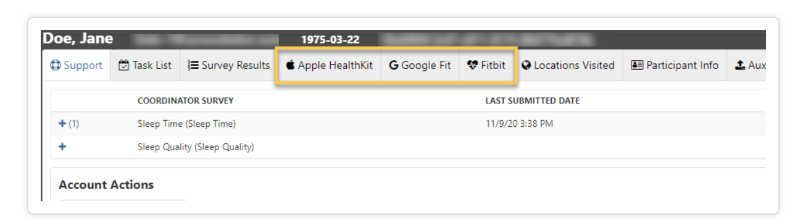
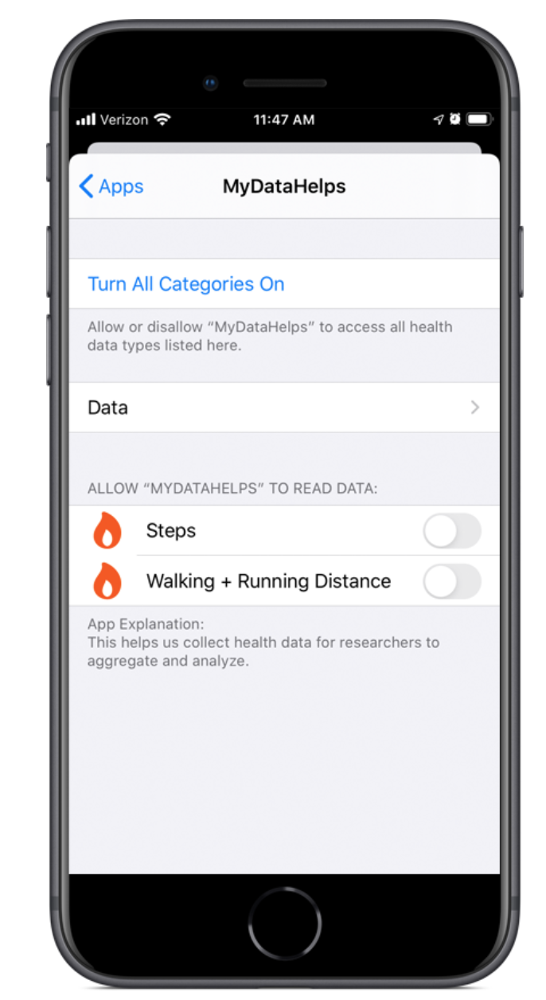
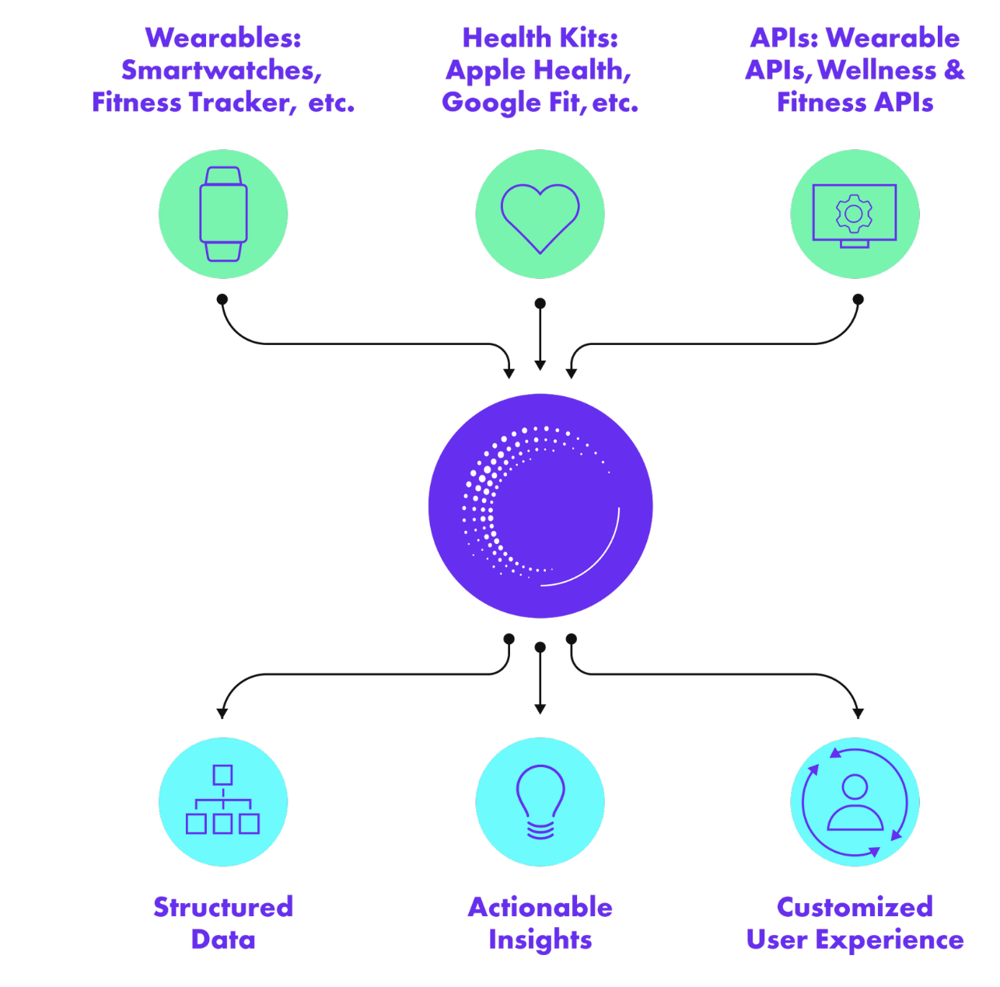

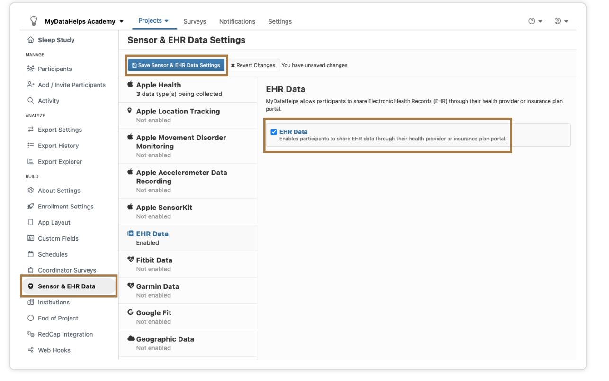
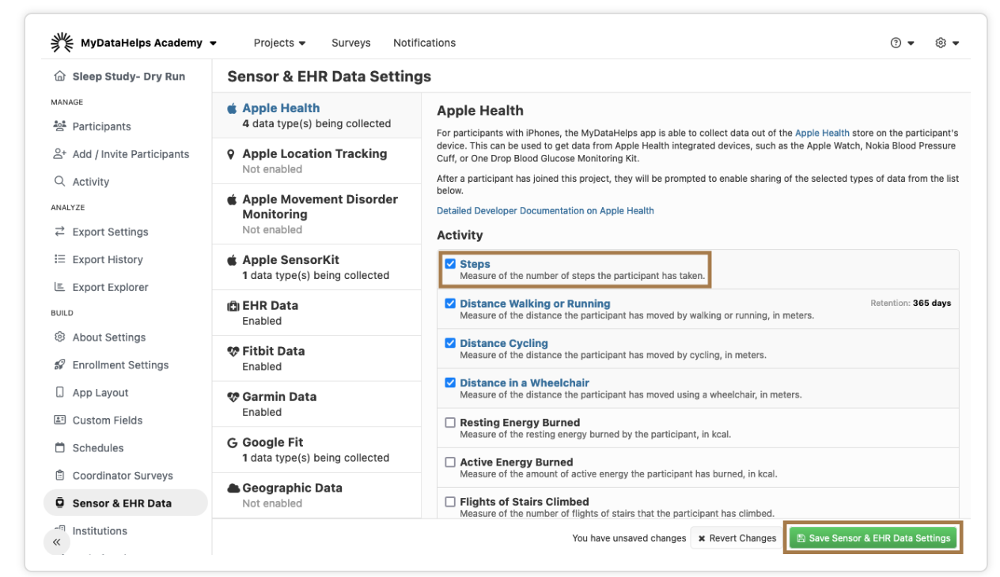
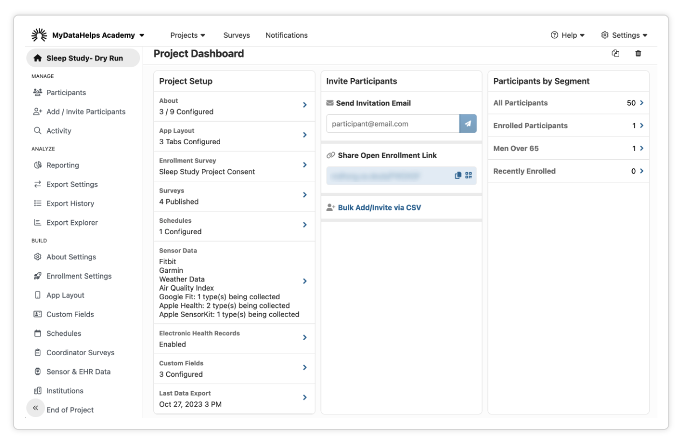
{: style="float: left"; margin-right: 10em; height="25%" width="25%"}

-->

Walk-through example of the CareEvolution Platform

Here is a walk-through example of the CareEvolution Platform. 

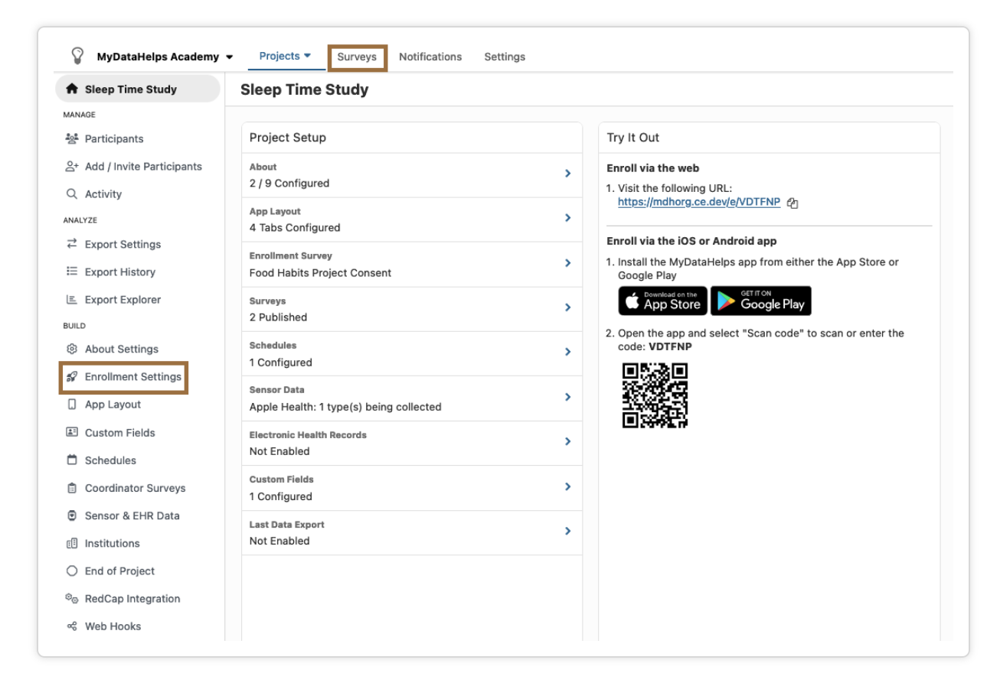
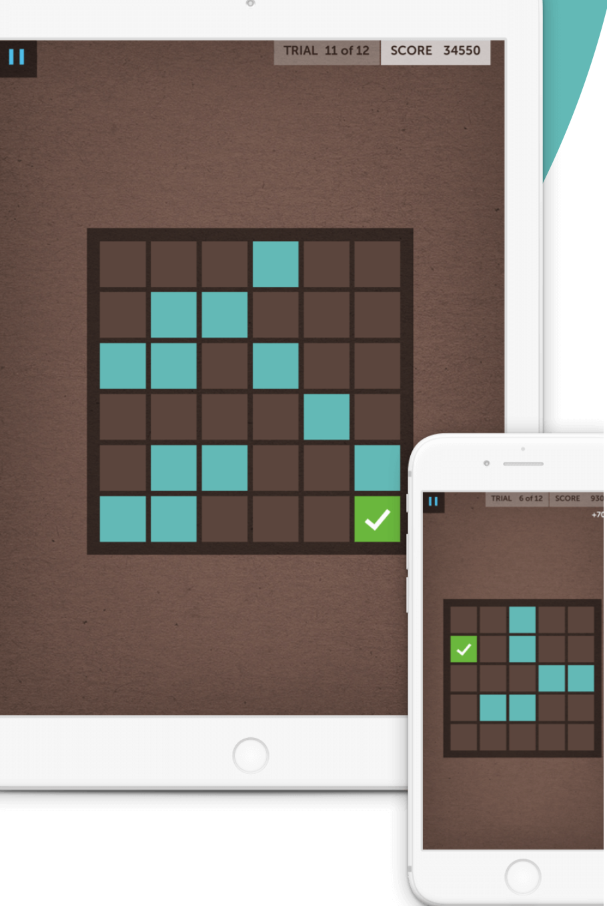
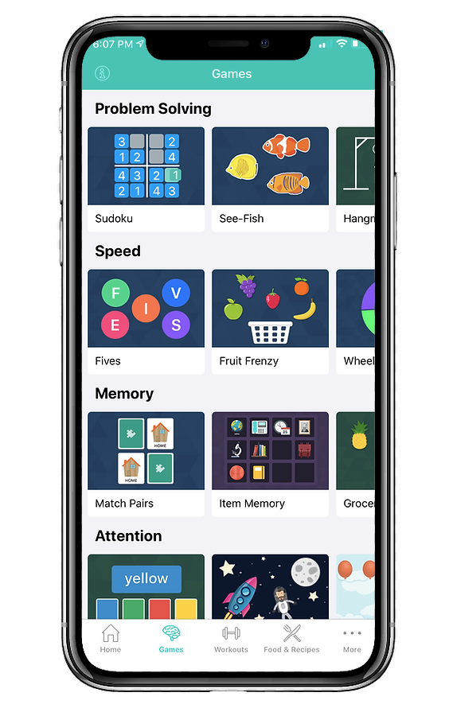

1. **Recruitment & eConsent:**

    - To start, register your account [here](https://designer.mydatahelps.org/StudyRegistration/DeveloperRegistration).
    - **Creating and Joining Workspaces:** To create projects, surveys, and recruitment notifications, you may want to create a workspace or join another that is accessible by registered users. A single user can be given access to multiple workspaces and can switch between them after logging in. More information can be found [here](https://support.mydatahelps.org/hc/en-us/articles/360022092813-Creating-and-Joining-Workspaces).
    - **Creating or Importing Surveys:** With MyDataHelps Designer's visual survey builder, you can create a variety of surveys, such as electronic patient-reported outcomes (ePROs), clinician-reported outcomes (ClinROs), and use ResearchKit Active Tasks to collect data from their phone's sensors. Learn how to build rich surveys [here](https://support.mydatahelps.org/hc/en-us/articles/360022100733-Creating-or-Importing-Surveys).
    - **Setting Up a Project:** A project lets you invite participants, schedule the delivery of surveys to them, and report data collected in the surveys. First, you create an organization, you will also be prompted to name the first project. Upon creation, you will be taken to the project dashboard, where you can navigate to various project settings, try out your project, or add participants and segments.
    - **Enrolling Participants:** The project dashboard displays various enrollment methods based on which platforms are enabled for enrollment. You can refer to the Enrollment Overview for information on the different enrollment methods and how to enable them. From the Participants tab, you can manage participants in the project. You can issue invitations, see who's completed enrollment, and view a summary of project participation.
    - **Gathering and Exporting Data:** Participants you've invited to your project use the MyDataHelps app to join the project, answer surveys, and share their sensor data.

2. **Sensor and EHR Data Collection:** MyDataHelps allows you to collect EHR data and sensor data collected from various health monitoring devices etc.
    - **Electronic Health Record (EHR) Data:** When creating a project, your team has the option to collect electronic health records (EHR) from participants. EHR data collection is only possible from providers who support FHIR connectivity standards. 

3.  **Sharing EHR Data from MyDataHelps:** When participants enroll in a project that has EHR data collection enabled, they will be prompted to enable the sharing of their health records. A participant just needs to click the prompt and follow the on-screen steps to connect their records to MyDataHelps.

4.  **Enabling Sensor Data Collection:** MyDataHelps integrates with several major data services—including Apple Health, Google Fit, and Fitbit—to collect sensor data from wearables and mobile apps. It also allows you to collect Geographic sensor data, including weather and air quality, from other third-party services. Many of these services have dozens of sensor data types available, including steps and activity, nutrition and weight, heart rate and other vital signs, health records. Any sensor data you collect will be included in your project's data exports.

5. **Limitations:** There are a few limitations in sensor data collection. The project settings specify which data services and sensor data types you have requested from each participant. The actual data collected will depend on several factors, including device capabilities, permissions, and participant demographics.

6.  **Viewing Sensor Data:** Once you've set up sensor data collection for your project, sensor data will be included in the data exports. Selected sensor data is also available through the participant viewer. This can help you be sure that data is being collected, or help you investigate if a participant experiences issues with reporting their data. Additionally, HealthKit data can be viewed as "Summary Data" (default) or "Raw Data" (helpful for looking at specific JSON datapoint information). 

7.  **Sharing Sensor Data from MyDataHelps:** MyDataHelps can collect certain sensor data from a participant's device, provided that the project has enabled sensor data collection.

### Radar-AD

RADAR-base is an open-source platform for real-time sensor data collection in observational studies and remote decentralized clinical trials with support for various sources such as wearable devices, mobile applications, APIs, and IoT devices. The platform aims to support the use of continuous connectivity and information provided by smartphones and wearable devices in research, with the long-term goal of improving people's quality of life in healthcare. RADAR-base has been used in over 45 research studies to study around 20 disease areas and is actively developed and maintained by a community of software engineers, architects, data scientists, and researchers.

<iframe width="560" height="315" src="https://www.youtube.com/embed/BRdDmd47u6U?si=UQV910C3UOonE_i9" title="YouTube video player" frameborder="0" allow="accelerometer; autoplay; clipboard-write; encrypted-media; gyroscope; picture-in-picture; web-share" referrerpolicy="strict-origin-when-cross-origin" allowfullscreen></iframe>

The video demonstrates how to manage studies, participants, and various data ingestion options using RADAR-base, an open-source platform for real-time sensor data collection in observational studies and remote decentralized clinical trials. The first step is to create a project in the study management system (also known as the management portal), assign data sources, and create users with project admin roles. To enroll a participant, a subject is created under the project, and a QR code is generated for the participant to scan using the mobile app (either PRMT for passive data collection or ARMT for surveys).

RADAR-base can also collect data from devices that send data to their own storage and share it via APIs, such as Fitbit. To enable this, users must authorize the RADAR-base application to collect data from their device's account through the authorization portal. The user's Fitbit account is then linked to a subject in the management portal, specifying the time window for data collection. For devices without an SDK or APIs, data can be manually uploaded using the RADAR-base data upload interface.

The demo concludes by showing data collected using the passive RMT app and Fitbit, which is then loaded into a data visualization tool. The data is structured by project name, subject ID, and data stream name, with folders containing timestamps of the data. The visualization includes 3D acceleration data, step count, battery level, connected Bluetooth devices, relative location, and time spent on various apps from the passive mobile app, as well as heart rate and step count data from Fitbit. The relative location data provides insight into the participant's movement without revealing their exact location, and correlations can be observed between the accelerometer data, step count, and heart rate when the participant is active.

**References**

[1] Ranjan, Yatharth, Zulqarnain Rashid, Callum Stewart, Pauline Conde, Mark Begale, Denny Verbeeck, Sebastian Boettcher, Richard Dobson, Amos Folarin, and RADAR-CNS Consortium. "RADAR-base: open source mobile health platform for collecting, monitoring, and analyzing data using sensors, wearables, and mobile devices." JMIR mHealth and uHealth 7, no. 8 (2019): e11734.

